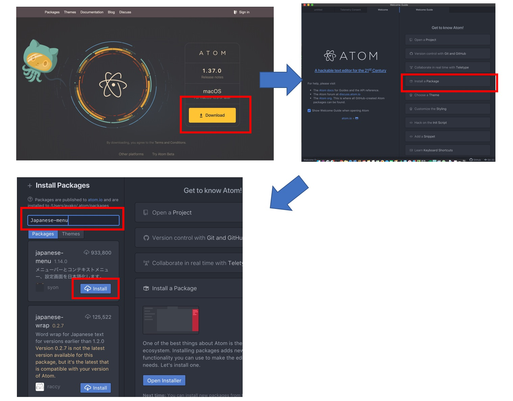

### Pythonのインストール

[Windows](https://www.python.org/downloads/windows/)   
  
<font size="4">Add Python ●● to PATH に必ずチェックをいれましょう。</font>  

[Mac](https://www.python.org/downloads/)


+++
<!-- 自己紹介 -->

+++

+++

+++

+++

+++

+++

+++

<!-- 自己紹介 -->
---

<!-- Pythonの話 -->

+++

### Pythonって何が出来るの？

+++

### 出来ることモロモロ
<font color="orange" size="5" face="Comic Sans MS">
機械学習を使った人工知能の開発<br>
自動データ処理や分析などの業務効率化<br>
スクレイピングによるWEB上の画像データ・テキストデータの自動収集<br>
WEBサービス・WEBアプリケーション制作<br>
スマホアプリ（Android） デスクトップアプリ制作<br>
フィンテック・ブロックチェーン技術の開発<br>
</font><br>

+++

### Pythonスキルを生かせる仕事とは？

+++

### こんなお仕事
人工知能（AI）エンジニア<br>
WEBアプリケーションエンジニア<br>
データサイエンティスト<br>
etc...<br>
+++

### 何故Pythonがいいの？

+++
<font color="orange" size="8" face="Comic Sans MS">
それは、私も今模索中。<br>
でも・・
</font>

+++
<font color="orange" size="8" face="Comic Sans MS">
間違いなく<br>
初心者にも優しい言語だと思います！
</font>

---
# Pythonの基礎
+++
### Pythonはオブジェクト指向の  
### プログラミング言語です。
+++

### オブジェクト指向とは？  

<font size="4">オブジェクト指向は、クラスを基準としたプログラムを設計する方法論の1つ</font>  


+++
#### クラスとメソッドと関数で構成されています。  

<font size="4">
  クラスの変数を属性。動作をメソッド。動作だけを記載した関数で構成されています。  
  １つ１つのデータ型、全てがオブジェクトです。  
  この話は、様々な人が様々な意見を持っているようです。  
  その話は第3回で改めお話します。
</font>
+++

### 変数

+++
#### 変数とは何でも入る箱です。


```python
# 文字も入る
a = "疲れてきた？大丈夫？"

# 数値も入る
b = 123

# そのほか色々入れられます。 
```


+++

### ターミナル・コマンドプロンプト 
### を立ち上げてみましょう

+++

##### ターミナル・コマンドプロンプト
<details><summary>Macの方  </summary>
<font size="4" color="red">［アプリケーション］→［ユーティリティ］→［ターミナル］を選択しましょう。</font>  </details>  
<details><summary>Windowsの方  </summary>
<font size="4" color="red">［スタート］→［Windowsシステムツール］→［コマンドプロンプト］を選択しましょう。  </font></details>  
        
+++

##### ターミナル・コマンドプロンプト
##### でPythonを起動しよう。  

<details><summary>Macの方  </summary>
<font size="4" color="red">Python3 と入力しエンター</font>  </details>  
<details><summary>Windowsの方  </summary>
<font size="4" color="red">Pythonと入力しエンター</font></details>

+++
<font size="6">こんな感じになっていればOK  
  ＊Pythonあとの数字とかは違っていても大丈夫です</font>  


+++
##### 数値や文字などの演算子


  
実際に使ってみましょう。


+++

### 文字列も計算してくれます

  


---
# 型の話

+++

### よく利用される型  
<font size="6">
int型：整数  
float型：小数点  
str型：文字列  
bool型：真偽値  
list型：リスト  
tuple型：タプル  
dict型：辞書  
</font>

+++
### int型：整数  
<font size="4">
Pythonの整数型には値の範囲がなく、システムのメモリ容量が許す限り、  
どんな大きな値の整数オブジェクトでも作成できます。  

文字列や浮動小数点数などをint型オブジェクトで整数に変換できます。  </font>

```
int("2") 
int(2.123)
```  

<font size="4">この２つは整数の２となります。</font>

+++
### float型：小数点  
<font size="4">
浮動小数点数の計算をする場合、小数点数を計算するときや丸めるときに誤差が発生する場合があります。  
このような問題を防ぐため、Pythonでは十進数の計算をするためのdecimalモジュールが用意されています。</font>  

```
x = 0.1
y = 0.2

print(x + y)
>>>0.30000000000000004
```

<font size="4">float型同士の計算では微妙なずれが生じます。</font>　　

```
from decimal import Decimal
 
x = Decimal("0.1")
y = Decimal("0.2")
 
print(x + y)
>>>0.3
```
+++
### str型：文字列
<font size="4">
文字列オブジェクトは、str型のオブジェクトです。数値や浮動小数点数などを文字列に変換する場合は、  
str型を呼び出して変換します。文字はダブルコーテーション " もしくはシングルコーテーション ' で囲みます。 
</font>

```
print(str(1) + str(0.1) + str(1+0.1))
>>> 1 + 0.1 = 1.1
```

```
print("Hello")
```


<font size="4">文字数を調べる組込関数</font>  

```
len("Hello")
>>>5
```
  
<font size="4">小文字に変換するメソッド</font>　　
```
"A Ａ".lower()
>>>'a ａ'
```
+++
### bool型：真偽値  

<font size="4">
ブール型（bool又はboolean）はプログラミング言語でよく使われる真偽値のことです。  
True(真）とFalse（偽）の二種類が用意されています。
</font>

```
bool1 = True  
if bool1 == True:  
    print ("処理を実行")  
```
<font size="4">のように、if文などの判断に使われる事が多いです。  
if文についての詳細は後半で説明します。</font>

+++
### list型：リスト  

```
li1 = ["A","B","c",1,2,3,["cc","dd"]]  
```
<font size="4">このように[ ]でくくったデータの集合体をリストと言います。  
リストには箱番号がついています。箱と箱は , で区切ります。</font>

  

<font size="4">部屋番号は0から始まります。各部屋の情報を取り出したい時は以下のように書きます。</font>  
```
# リストの0番目を取り出したい
print (li1[0])

>>> A
```

+++
### tuple型：タプル  
```
li1 = ("A","B","c",1,2,3,["cc","dd"])
```
<font size="4">このように( )でくくったデータの集合体をタプルと言います。  
リストと同じように箱番号が0からついています。  
箱と箱は , で区切ります。 
リストと異なるのは、更新が出来ないという事です。</font>
```
# リストの場合
li1 = ["A","B","c",1,2,3,["cc","dd"]]  
li1[0] = "Change"
print li1
>>> ["Change","B","c",1,2,3,["cc","dd"]] 

# タプルで同じ事をやると・・
Traceback (most recent call last):
  File "<stdin>", line 1, in <module>
TypeError: 'tuple' object does not support item assignment
```
+++
### dict型：辞書  
```
d1 = {"apple": "りんご","B": 2,"C": 3}
```
<font size="4">このように{ } でくくって　Key： Value で記載された集合体を辞書と言います。  
英語辞書をイメージしてください。appleというKeyを調べると、りんごというvalueが確認できます。  
Keyを使って、Valueを確認したいときは以下のように使います。  </font>
```
print (d1["apple"])
>>> りんご
```
+++


---
# ファイルを使って  実行しよう 
+++

### ファイルを使って実行しよう  
<font size="4">ここまではターミナルもしくはコマンドプロンプトを使ってPythonとたわむれてきました。  
ここからは一度書いたプログラムを繰り返し実行できる方法をご紹介します。  
テキストエディターを使って記載し、そのファイルを実行する事でプログラムを動かす事が出来ます。
ターミナルやコマンドプロンプトは一回書いて、閉じたら終わり。それではアプリなど作れないので・・  
適切なテキストエディタを利用します。  
かつ、プログラミングを書くのに適したエディタが無料で色々あります。  
色々試して自分の使いやすいものを探すと良いでしょう。
私はAtomもしくはKomodoEditを使う事が多いです。  
[Atomインストール](https://atom.io)</font>
+++


+++
### ファイルを保存する場所を用意する  
<font size="4">今日は単純にデスクトップにフォルダをつくって、そこにファイルを入れてきましょう。  
ターミナルもしくはコマンドプロンプトに戻りましょう。</font>

```
>>>|
```
<font size="4">先ほど使ったままにしている方はおそらく↑のようになっていると思います。  
  なっている方は exit() と入力してpythonの環境から抜けましょう。  
  *なっていない方は無視してください。  </font>
+++
### デスクトップにフォルダを作ります。  
<font size="4">ターミナルやコマンドプロンプトは、デフォルトでは基本ご自身のパソコンの  
ホームディレクトリと呼ばれる場所にいます。  
せっかくなのでコマンドでプログラマーっぽく、作りましょう。</font>  

```
cd Desktop
```

<font size="4">デスクトップに移動します。</font>  

```
mkdir elvpython
```

<font size="4">デスクトップにelvpythonというディレクトリ（フォルダのことです）を作成します。</font>

```
cd elvpython
```

<font size="4">作成したディレクトリ内に移動します。</font>  

+++
### テキストエディタに　　
### コードを書いてみよう  

<font size="4">先ほどインストールしたAtomもしくはお好きなテキストエディタを開きます。</font>

```
print ("Hello World")
```
<font size="4">と書いて、先ほど作ったディレクトリに test.py という名前で保存しましょう。</font>

+++
### 実行  
<font size="4">コマンドプロンプトもしくはターミナルに戻りましょう。  </font>
<details><summary>Macの方  </summary>
<font size="6" color="red">`python3 test.py`  </font></details>  
<details><summary>Windowsの方  </summary>
<font size="6" color="red">`python test.py`  </font></details>  
 <font size="4">と入力してエンターキーを押下！！  </font>

```
Hello World
```

<font size="4">と出たら、成功です！！　おめでとうございます！！</font>
---
# if文  
+++
### if文は条件分岐です  
<font size="4">ifという言葉の通り、「もし〜だったら」を想定して書きます。  
こんな記事が少し前に海外で人気になったそうです。    
ある妻がプログラマの夫に「買い物にいって牛乳を1つ買ってきてちょうだい。  
卵があったら6つお願い」と言った。  

+++
##### このオチはこうです。
<font size="4">
夫はしばらくして、牛乳を6パック買ってきた。  
妻は聞いた「なんで牛乳を6パックも買ってきたのよ！」  
夫いわく「だって、卵があったから……」</font>
</font>

+++
### どういうことかわかりますか？  


+++
### これをPythonで書くなら・・  

```
if egg in store:
    milk_buy(6)
else:
    milk_buy(1)
```

<font size="4">こんな感じですかね・・</font>

+++
### Pythonのif文  

<font size="4">条件が１つの場合それ以外は何もしない</font>

```
if 条件を記載します:
    条件を満たしたときはここに記載の実行内容を実行
```

<font size="4">条件が複数ある場合</font>

```
if 最初の条件を記載します:
    最初の条件を満たした時に実行したい内容を記載
elif 最初の条件を満たさなかったものの中から次の条件を記載します。
    二個目の条件を満たした時に実行したい内容を記載
else:
    全ての条件を満たさなかった場合に記載
```

<font size="4">必ず条件指定の下はインデントを下げます（半角スペース4つ分)  
インデントが下がっている間がその条件の有効範囲となります。</font>

+++
### 比較演算子  


+++
# 実際に書いてみよう

+++


```python
# xとyが等しい場合はYes等しくない場合はNoを表示する
x = y = 2 

'''
xが10より小さければ xは10より小さいと表示
xが10と等しければ　xは10ですと表示
xが１０よりも大きければxは10より大きいと表示
'''
x = 6

```

<font size="4">if_study.pyというファイル名で先ほど作成したディレクトリに保存しましょう。</font>

+++
# 解答
## 自分で出来てから見てね！
+++

```python
# xとyが等しい場合はYes等しくない場合はNoを表示する
x = y = 2
if x == y:
    print("Yes")
else:
    print("No")
    
'''
xが10より小さければ xは10より小さい と表示
xが10と等しければ　xは10です と表示
xが１０よりも大きければ xは10より大きい と表示
'''
x = 6
if x < 10:
    print("xは10より小さい")
elif x == 10:
    print("xは10です")
else:
    print("xは10より大きい")

```
---
# for文

+++

### for文は繰り返し処理です。

<font size="4">例えば10までの数字を順番に表示したい場合</font>


```python
for i in range(10):
    print(i)
```

<font size="4">このように書きます。  
for の後に　変数　in 順番に取り出したい集合体を指定します。  
range(10)は[0,1,2,3,4,5,6,7,8,9]のリストを作る関数です。</font>

+++


+++
# 実際に書いてみよう

+++
<font size="4">
1～100までの数値を表示し、３で割り切れる数の時だけその数字と
Hello　
という文字、それ以外は数字のみを書き出してみよう。
"%d Hello"%変数
</font>
+++
# 解答
## 自分で出来てから見てね！
+++

```python
for i in range(1,101):
    if i % 3 == 0:
        print("%d Hello"%i)
    else:
        print(i)
```
+++
## これ知っておくと便利　　
#### enumerate()関数　　

```python
for index, i in enumerate(range(1,101)):
    print("%d %d"%(index, i))

--実行結果
0 1
1 2
2 3
･
･
･
```


+++
## 多重ループ  
## （ネストしたforループ）
+++
### 多重ループ

<font size="4">多重ループとはfor文の中でfor文をまわす事をいいます。  </font>

```python
l1 = [1, 2, 3]
l2 = [10, 20, 30]

for i in l1:
    for j in l2:
        print(i, j)
# 1 10
# 1 20
# 1 30
# 2 10
# 2 20
# 2 30
# 3 10
# 3 20
# 3 30
```
+++
# 応用問題
+++

<font size="4">１日が月曜日で３１日までを　日にち　曜日　で書き出そう  
1 月曜日  
2 火曜日  
3 水曜日  
･  
･  
･  </font>
+++

+++
# 解答
## 自分で出来てから見てね！
+++

```python
day_list = ["月曜日",
            "火曜日",
            "水曜日",
            "木曜日",
            "金曜日",
            "土曜日",
            "日曜日"
            ]

count_no = 0
for index, i in enumerate(range(1,32)):
    if index % 7 == 0:
        count_no = 0
    else:
        count_no += 1
    print("%d %s"%(i, day_list[count_no]))
```

---


    
        

